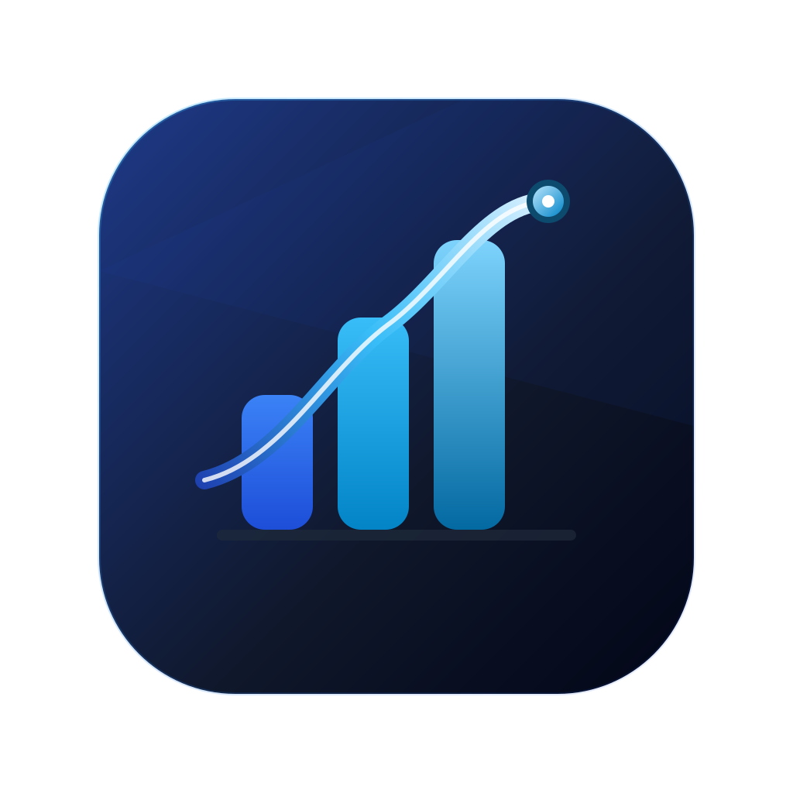

# Personal Finance

<p align="center">
  
</p>

Aplikasi keuangan pribadi **offline-first** untuk desktop dan mobile: pencatatan arus kas, pemantauan saldo lintas bank/e-wallet, serta alokasi pos tabungan (*envelope budgeting*), dengan sinkronisasi opsional ke Google Spreadsheet.

## Fitur Utama

- **Multi-akun** — Bank, E-Wallet, Cash, Investasi.
- **Transaksi** — pemasukan, pengeluaran, serta transfer antar-akun.
- **Pos tabungan** — target nominal, progres, dan estimasi setor mingguan.
- **Dashboard** — net worth, cashflow bulanan, serta pengeluaran per kategori.
- **Riwayat** — filter, pencarian, dan ekspor CSV.
- **Sinkronisasi dua arah** ke Google Spreadsheet.
- **Offline-first** — data tersimpan di SQLite lokal dan sinkronisasi berjalan di latar belakang.
- **Presisi uang** — nominal tersimpan sebagai `i64` Rupiah.

## Tech Stack

| Lapisan | Teknologi |
| --- | --- |
| Shell & IPC | Tauri v2 (Windows, macOS, Linux, Android, iOS) |
| Backend core | Rust — `rusqlite`/SQLite, `reqwest` + `tokio` |
| Frontend | SvelteKit + Svelte 5, Tailwind CSS |
| Sync backend | Google Apps Script Web App (`database-core/`) |

## Struktur Proyek

```text
src/            # Frontend SvelteKit (5 halaman + komponen)
src-tauri/      # Rust core: model, SQLite, IPC commands, sync engine
database-core/  # Backend Google Apps Script (endpoint sync)
```

## Tutorial Install

### Prasyarat

- Rust + Cargo
- Node.js + npm

### Development

```bash
npm install
npm run tauri dev
```

### Build desktop

```bash
npm run tauri build
```

### Build Android

```bash
npm run tauri android init
npm run tauri android build -- --apk --target aarch64
```

## Tutorial Menggunakan

- **Dashboard** — lihat net worth, cashflow bulanan, dan ringkasan pengeluaran.
- **Riwayat** — cari, filter, dan ekspor transaksi.
- **Tabungan** — buat pos tabungan, tetapkan target, dan pantau progres.
- **Dompet** — kelola akun bank, e-wallet, cash, serta investasi.
- **Setelan** — atur preferensi, integrasi Google Spreadsheet, dan sinkronisasi.
- **Pengaturan → Cek Pembaruan** — update otomatis dari GitHub.

## Tutorial Setup Database Core

Database Core adalah **endpoint Google Apps Script** yang menjadi database awan untuk sinkronisasi dua arah. Kode inti (`Code.gs`) diambil otomatis dari GitHub melalui loader.

### 1. Pasang Loader

1. Buat spreadsheet baru di [Google Sheets](https://sheets.google.com).
2. Buka **Extensions > Apps Script**.
3. Hapus isi editor, lalu tempel kode loader berikut:

```javascript
/**
 * Personal Finance — Database Core (LOADER)
 * Tempel kode ini di editor Google Apps Script. Kode inti (Code.gs) diambil
 * otomatis dari GitHub, jadi tidak perlu copy-paste manual dan selalu terbaru.
 */
const PF_RAW_BASE = 'https://raw.githubusercontent.com/Yudhistira-Official/personal-finance/main/database-core/';
const PF_CORE_FILE = 'Code.gs';
const PF_CACHE_KEY = 'pf_dbcore_v4';
const PF_CACHE_TTL = 1000; // detik

// Referensi STATIS ke SpreadsheetApp. Kode SpreadsheetApp asli ada di dalam
// eval() (Code.gs dari GitHub) sehingga TIDAK terdeteksi analyzer scope Apps
// Script. Baris ini memaksa scope "spreadsheets" diminta saat otorisasi,
// tanpa itu setup()/push()/fetch() gagal dengan "permissions are not sufficient".
function pfScopeHint_() {
  return [SpreadsheetApp.getActiveSpreadsheet, UrlFetchApp.fetch, CacheService.getScriptCache, ContentService.createTextOutput];
}

function pfFetchCore_() {
  var cache = CacheService.getScriptCache();
  var code = cache.get(PF_CACHE_KEY);
  if (!code) {
    var res = UrlFetchApp.fetch(PF_RAW_BASE + PF_CORE_FILE, { muteHttpExceptions: true });
    var status = res.getResponseCode();
    if (status !== 200) {
      throw new Error('Gagal mengambil ' + PF_CORE_FILE + ' dari GitHub (HTTP ' + status + ').');
    }
    code = res.getContentText();
    cache.put(PF_CACHE_KEY, code, PF_CACHE_TTL);
  }
  return code;
}

function pfJson_(obj) {
  return ContentService.createTextOutput(JSON.stringify(obj))
    .setMimeType(ContentService.MimeType.JSON);
}

// Titik masuk Web App — eval Code.gs lalu panggil fungsinya lewat globalThis.
function doGet(e) {
  pfScopeHint_();
  try { eval(pfFetchCore_()); return globalThis.handleGet_(e); }
  catch (err) { return pfJson_({ success: false, message: 'Loader: ' + err.message }); }
}
function doPost(e) {
  pfScopeHint_();
  try { eval(pfFetchCore_()); return globalThis.handlePost_(e); }
  catch (err) { return pfJson_({ success: false, message: 'Loader: ' + err.message }); }
}

// Jalankan sekali untuk membuat sheet + header.
function setup() {
  pfScopeHint_();
  eval(pfFetchCore_());
  return globalThis.runSetup_();
}
```

4. Klik **Simpan** (Ctrl+S).

### 2. Jalankan `setup()`

Pilih fungsi **`setup`** di toolbar, klik **Run** (▶), lalu setujui **Review permissions → Allow**. Fungsi ini membuat sheet `Transactions`, `Accounts`, `Savings`, dan `Categories` beserta header standarnya.

### 3. Deploy

Buka **Deploy > New deployment**, pilih **Web app**, atur **Execute as: Me** dan **Who has access: Anyone**, lalu klik **Deploy**. Salin URL yang berakhiran `/exec`.

### 4. Hubungkan ke Aplikasi

Buka **Personal Finance > Pengaturan > Integrasi Google Spreadsheet**, tempel URL `/exec`, lalu pilih **Uji Koneksi**. Gunakan **Kirim Data** untuk push dan **Tarik Data** untuk fetch; **Auto-Sync** bersifat opsional.

### Alur Data

```text
[Catat transaksi di UI]
        │  Tauri IPC
        ▼
[State Rust] ──► [SQLite lokal]  (offline-first, selalu tersimpan)
        │
        ▼  async worker (reqwest/tokio)
[Google Apps Script /exec]  ◄── push (POST) / fetch (GET)
        ▼
[Google Spreadsheet milikmu]
```

- **Push** mengirim transaksi berstatus `pending`/`failed` secara idempoten berdasarkan `id`.
- **Fetch** menggabungkan data Sheets ke SQLite lokal tanpa duplikasi.

### Endpoint

| Operasi | Method | URL / Body |
| --- | --- | --- |
| Health check | `GET` | `<url>` |
| Fetch | `GET` | `<url>?action=fetch` |
| Push | `POST` | `{"action":"push","transactions":[...]}` |

### Memperbarui Kode

Ubah `database-core/Code.gs`, lalu push ke GitHub. Loader mengambil versi baru otomatis setelah cache ~17 menit (1000 detik) kedaluwarsa. Naikkan `PF_CACHE_KEY` untuk memaksa refresh. Tidak perlu menempel ulang loader.

## Catatan Privasi

Data disimpan lokal di SQLite pada folder aplikasi. Tidak ada data finansial dikirim ke pihak ketiga selain Google Spreadsheet milikmu sendiri.
